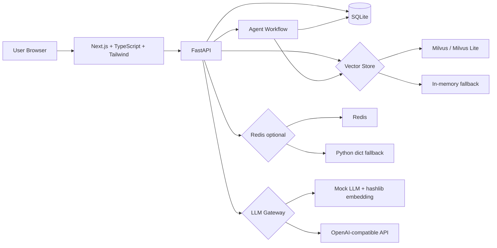
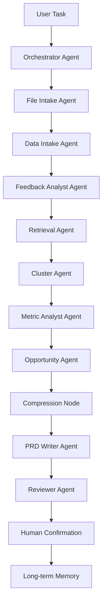
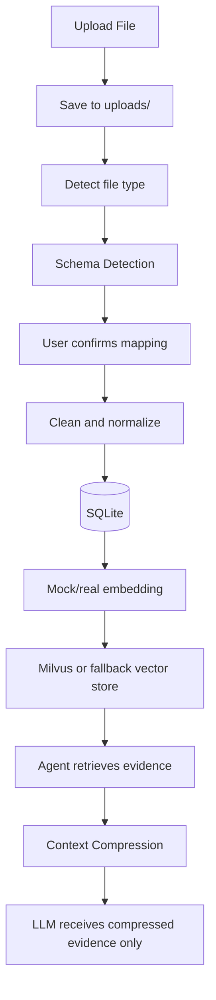

# FeedbackOS Agent｜AI 产品需求发现多智能体平台

FeedbackOS Agent 是面向产品经理的多智能体需求发现工作台。系统以用户上传文件为核心入口，支持客服工单、App 评论、用户访谈纪要、NPS 开放题、业务指标表、历史 PRD 和版本复盘等资料的解析、清洗、入库、向量化与证据检索，并通过 LangGraph 风格的多 Agent workflow 完成反馈分析、痛点聚类、机会点评估、PRD 生成、Reviewer 质量评审、人工确认和长期记忆沉淀。

本项目不内置业务 demo 数据，不提供 Seed Demo Data 按钮。所有业务数据必须来自用户上传文件或用户在页面手动录入。LLM 不接收完整原始文件，只接收经过结构化入库、检索和上下文压缩后的相关证据。API Key 只从后端环境变量读取。

## 核心功能

- Upload Center：上传 CSV、Excel、TXT、Markdown、DOCX，解析文件类型、识别数据类型、预览字段映射并确认入库。
- Feedback Inbox：查看已入库反馈、摘要、情绪、模块、严重度和问题类型。
- Agent Console：运行 Orchestrator、Intake、Analyst、Retrieval、Cluster、Metric、Opportunity、PRD Writer、Reviewer、Compression 全链路。
- Insight Clusters：基于标签、规则和语义证据生成痛点聚类。
- Opportunity Board：按优先级公式生成 P0/P1/P2 机会点，且没有 evidence_ids 的机会点不会被标记为 P0。
- PRD Studio：查看和编辑 Markdown PRD，并调用 Reviewer 评审。
- Memory Center：展示待确认记忆、已确认记忆、决策记忆和用户偏好记忆。
- Evaluation：展示 Agent、LLM、检索证据、生成质量和上下文压缩指标。

## 技术架构



## Agent Workflow



## 用户上传文件处理流程



## 数据库说明

SQLite 存结构化业务数据、PRD、Agent trace、长期记忆和评估数据。核心表包括：

- `projects`, `uploaded_files`, `data_sources`
- `feedback_items`, `metric_snapshots`, `document_chunks`
- `insight_clusters`, `opportunities`, `prd_documents`
- `agent_runs`, `agent_steps`
- `project_memory`, `user_preference_memory`, `decision_memory`
- `llm_calls`, `retrieval_logs`, `compression_logs`, `evaluation_results`

`uploads/` 是用户上传文件目录。`storage/exports/` 是导出文件目录。`storage/prds/` 可用于保存 PRD 导出文件。

## Milvus / Redis

Milvus 存用户反馈、文档片段、PRD 片段 embedding，用于相似反馈召回和证据追溯。本地运行时系统优先尝试向量能力，但 Milvus 不可用时会自动使用内存 fallback vector store，API 不会崩。

Redis 是可选增强，用于：

- `agent_run:{run_id}:progress`
- `llm_cache:{hash}`
- `session_state:{session_id}`

Redis 不可用时系统 fallback 到 Python dict。

## 记忆与上下文压缩

LangGraph 负责任务编排、短期记忆、节点状态流转和人工确认节点。短期记忆保存在 `AgentState` 中，包括任务、消息、检索证据、证据摘要、指标摘要、PRD 草稿、Reviewer 结果等。

长期记忆保存在 SQLite，不放 Redis。`project_memory`、`decision_memory`、`user_preference_memory` 写入前必须经过人工确认。

Context Compression 压缩三类上下文：

- conversation_summary：多轮对话历史摘要
- evidence_summary：Milvus/fallback 召回证据摘要
- step_summary：Agent 中间结果摘要

压缩日志写入 `compression_logs`，压缩率公式为：

```text
context_compression_rate = 1 - compressed_tokens / original_tokens
```

## Evaluation / Observability

Evaluation 页面从真实运行表计算指标：

- Agent：运行总次数、成功率、平均 Step 数、工具调用数
- LLM：调用次数、平均延迟、输入/输出 token、预估成本、缓存命中率、JSON 解析成功率
- Retrieval：检索次数、平均 Top-K 返回数、平均相似度、无结果率、机会点证据覆盖率
- Quality：PRD 完整度、Reviewer 平均分、幻觉风险分布、人工确认比例
- Compression：各类压缩次数、平均压缩前/后 token、平均压缩率

## 本地运行步骤

后端：

```bash
cd backend
python -m venv .venv
.venv\Scripts\activate
pip install -e .
uvicorn app.main:app --reload
```

前端：

```bash
cd frontend
npm install
npm run dev
```

打开 `http://localhost:3000`，默认进入 Dashboard。后端健康检查为 `http://localhost:8000/health`。

## 环境变量

复制 `.env.example` 为 `.env`，按需配置：

```text
OPENAI_API_KEY=
OPENAI_BASE_URL=https://api.openai.com/v1
OPENAI_MODEL=gpt-4o-mini
EMBEDDING_MODEL=text-embedding-3-small
USE_MOCK_LLM=true
DATABASE_URL=sqlite:///./storage/feedbackos.db
REDIS_URL=redis://localhost:6379/0
MILVUS_LITE_PATH=./storage/milvus_lite.db
FRONTEND_ORIGIN=http://localhost:3000
```

没有真实 API Key 或 `USE_MOCK_LLM=true` 时，系统使用 Mock LLM 与 mock embedding。Mock LLM 用于本地开发、演示兜底和流程回归测试，结果只基于上传解析后的反馈、指标、文档片段、用户任务和 SQLite 已有数据。

有真实 API Key 时，将 `USE_MOCK_LLM=false` 即可调用 OpenAI 兼容 API。

## 文件上传格式

- 反馈类 CSV / Excel：包含反馈、评论、内容、建议等文本列。系统会识别 `feedback_text`、`event_time`、`channel`、`user_segment` 等字段。
- 指标类 CSV / Excel：包含指标名、指标值、日期、维度等字段。系统写入 `metric_snapshots`，默认不向量化。
- TXT / MD / DOCX：系统读取文本并分段 chunk，写入 `document_chunks`，相关反馈片段可进入 `feedback_items`，chunk 会生成 embedding。

## 如何测试系统效果

1. 端到端 Agent workflow 测试：上传自己的反馈文件，解析、确认、入库后在 Agent Console 运行任务，检查 Timeline 是否覆盖 Orchestrator 到 Compression。
2. 分类准确率测试：准备一份带人工标签的反馈文件，对比 `feedback_items` 中情绪、模块、严重度字段。
3. 检索 Top-K 可用率测试：在 Agent Console 输入专题问题，检查 `retrieval_logs` 与召回证据是否相关。
4. PRD 完整度测试：生成 PRD 后检查是否包含背景与问题、目标用户、用户故事、需求范围、功能流程、验收标准、埋点指标、风险点和证据引用。
5. Reviewer 拦截率测试：对缺少证据引用或验收标准的 PRD 调用 Reviewer，检查 problems、suggestions、hallucination_risk。
6. 上下文压缩率测试：运行多步 Agent 后查看 Evaluation 的平均上下文压缩率和 `compression_logs`。
