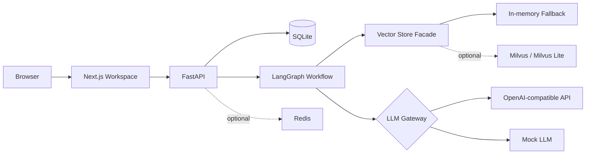
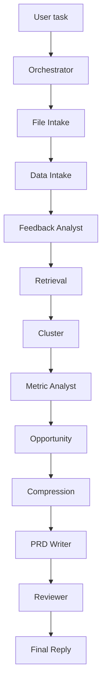

# FeedBackOS

面向产品经理的 Chat-first AI 需求发现工作台，用于用户反馈分析、机会点发现和 PRD 生成。

FeedBackOS 支持用户在一个聊天会话中上传客服工单、App 评论、用户访谈纪要、NPS 开放题、业务指标表、历史 PRD 或版本复盘文件，系统会先完成解析、清洗、结构化入库和向量化，再通过 LangGraph Agent workflow 进行反馈分析、痛点聚类、机会点评估、PRD 生成和 Reviewer 质量评审。


## 预览


## 核心功能

- Chat-first Agent Workspace，在聊天页面上传文件和发起分析任务。
- 基于 `conversation_id` 的会话级数据隔离。
- 支持 CSV、Excel、TXT、Markdown、DOCX 文件上传和解析。
- 反馈分类：情绪、严重度、产品模块、问题类型、一句话摘要。
- 轻量 RAG 流程：解析、清洗、入库、向量化、检索、压缩，再调用 LLM。
- LangGraph 多 Agent workflow：反馈分析、痛点聚类、机会点评分、PRD 生成、Reviewer 评审。
- 支持在同一会话中生成多份不同痛点的 PRD，例如：`写一份针对支付体验痛点的 PRD`。
- PRD 历史面板，支持切换、编辑、保存、导出 Markdown 和 DOCX。
- Reviewer 面板，展示综合评分、证据覆盖、问题和建议。
- Evaluation 面板，展示 Agent、LLM、证据、Reviewer 和上下文压缩指标。
- 支持真实 LLM 和 Mock LLM 双模式；没有 Redis、Milvus 或真实 API Key 时仍可运行完整流程。

## 技术栈

前端：

- Next.js
- TypeScript
- Tailwind CSS
- Recharts
- lucide-react

后端：

- FastAPI
- Python 3.11+
- LangGraph
- SQLAlchemy
- SQLite
- Pydantic
- Uvicorn
- python-docx

AI 与检索：

- OpenAI-compatible Chat Completions API
- OpenAI-compatible Embeddings API
- YAML Prompt 管理
- Mock LLM
- Mock embedding
- 内存 fallback vector store
- Redis 可选

## 架构



## Agent Workflow



当前 workflow 以固定顺序为主。Opportunity 节点会根据用户输入选择目标痛点。如果用户说“写一份针对支付体验痛点的 PRD”，系统会优先选择支付相关机会点，而不是始终选择最高优先级机会点。

## 数据处理流程

上传文件不会被直接整体发送给 LLM。

```text
上传文件
→ 文件解析
→ 字段识别或文本类型识别
→ 清洗和标准化
→ 写入 SQLite
→ 生成 embedding
→ 按 conversation_id 检索相关证据
→ 压缩上下文
→ 仅将相关压缩证据发送给 LLM
```

支持文件类型：

- CSV / Excel：反馈表或指标表。
- TXT / Markdown / DOCX：用户访谈、调研笔记、会议纪要、历史 PRD、版本复盘。

主要数据表：

- `conversations`, `conversation_messages`
- `uploaded_files`, `data_sources`
- `feedback_items`, `metric_snapshots`, `document_chunks`
- `insight_clusters`, `opportunities`, `prd_documents`
- `agent_runs`, `agent_steps`
- `llm_calls`, `retrieval_logs`, `compression_logs`
- `project_memory`, `decision_memory`, `user_preference_memory`

## Prompt 管理

Prompt 统一放在：

```text
backend/app/prompts/
```

运行时由下面的 loader 读取和缓存：

```text
backend/app/core/prompt_loader.py
```

当前接入的 prompt 文件：

- `feedback_analyst.yaml`
- `prd_writer.yaml`
- `reviewer.yaml`
- `compression.yaml`
- `default.yaml`

每个 prompt 文件包含元信息和 `system_prompt`：

```yaml
name: prd_writer
version: 1
owner: prd_writer_agent
response_format: json_object
system_prompt: |
  ...
```

`llm.py` 只负责模型选择、LLM 调用、Mock fallback 和调用日志记录。

## 本地运行

后端：

```bash
cd backend
python -m venv .venv
.venv\Scripts\activate
pip install -r requirements.txt
uvicorn app.main:app --reload
```

前端：

```bash
cd frontend
npm install
npm run dev
```

打开：

```text
http://localhost:3000
```

健康检查：

```text
http://localhost:8000/health
```

## 环境变量

复制 `.env.example` 为 `.env`，放在项目根目录。

```env
OPENAI_API_KEY=
OPENAI_BASE_URL=https://dashscope.aliyuncs.com/compatible-mode/v1
OPENAI_MODEL=qwen-plus
EMBEDDING_MODEL=text-embedding-v4
USE_MOCK_LLM=false

DATABASE_URL=sqlite:///./storage/feedbackos.db
REDIS_URL=redis://localhost:6379/0
MILVUS_LITE_PATH=./storage/milvus_lite.db
FRONTEND_ORIGIN=http://localhost:3000
```

如果没有真实模型 Key：

```env
USE_MOCK_LLM=true
```

如果使用阿里云百炼 / DashScope OpenAI 兼容模式：

```env
OPENAI_BASE_URL=https://dashscope.aliyuncs.com/compatible-mode/v1
OPENAI_MODEL=qwen-plus
EMBEDDING_MODEL=text-embedding-v4
OPENAI_API_KEY=your_bailian_key
```

API Key 只由后端读取，前端不保存密钥。

## 项目结构

```text
feedbackos-agent/
  backend/
    app/
      agents/
      api/
      core/
      db/
      prompts/
      services/
      vectorstore/
    uploads/
    storage/
    requirements.txt
    pyproject.toml
  frontend/
    app/
    components/
    lib/
  README.md
  README-ZH.md
  .env.example
  docker-compose.yml
```

运行时目录：

- `backend/uploads/`：用户上传文件。
- `backend/storage/exports/`：导出文件，例如 DOCX。
- `backend/storage/prds/`：PRD 存储目录预留。
- `backend/storage/feedbackos.db`：本地 SQLite 数据库。

这些运行时文件已加入 `.gitignore`，不会上传到 GitHub。

## Demo 测试流程

1. 启动后端和前端。
2. 打开 `http://localhost:3000`。
3. 上传反馈 CSV、Excel、TXT、Markdown 或 DOCX 文件。
4. 查看 `当前文件` 和 `Feedback Inbox`。
5. 输入：

```text
分析当前反馈并生成机会点
```

6. 输入：

```text
写一份针对支付体验痛点的 PRD
```

7. 查看 `Insight Cluster`、`PRD`、`Reviewer` 和 `Evaluation` 面板。


