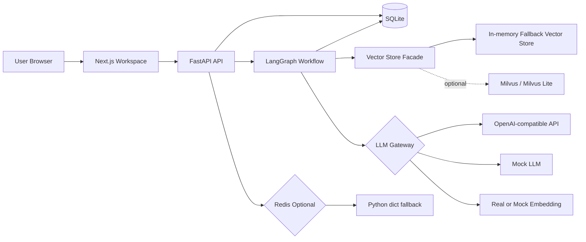
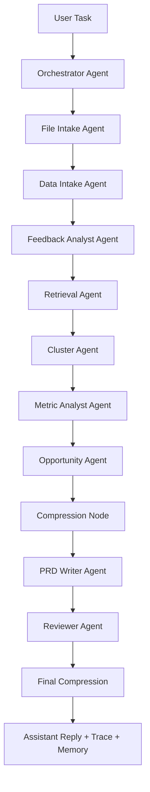
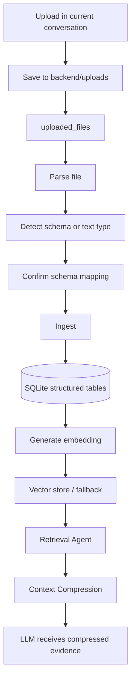

# FeedbackOS Agent｜AI 产品经理需求发现智能体

FeedBackOS 是一个面向产品经理的 Chat-first AI 需求发现工作台。用户在一个聊天会话中上传客服工单、App 评论、用户访谈纪要、NPS 开放题、业务指标表、历史 PRD 或版本复盘文件，系统会先完成解析、清洗、结构化入库和向量化，再通过 LangGraph Agent workflow 进行反馈分析、痛点聚类、机会点评估、PRD 生成和 Reviewer 质量评审。


## 当前产品形态


## 核心能力

- 文件上传与数据接入：支持 CSV、Excel、TXT、Markdown、DOCX。
- Schema Detection：识别反馈字段、指标字段和文本类文件类型。
- 结构化入库：反馈、指标、文档 chunk、Agent trace、PRD、记忆和评估数据写入 SQLite。
- 轻量 RAG：反馈和文档 chunk 生成 embedding，写入向量检索层；Agent 运行时按当前会话检索相关证据。
- 多 Agent workflow：Orchestrator、File Intake、Data Intake、Feedback Analyst、Retrieval、Cluster、Metric Analyst、Opportunity、Compression、PRD Writer、Reviewer。
- 真实 LLM / Mock LLM 双模式：支持 OpenAI-compatible API；没有 Key 或调用失败时使用 mock 规则兜底。
- Reviewer 评审：检查 PRD 完整度、证据覆盖、幻觉风险、问题和建议。
- 历史 PRD：可以在同一会话中生成多个痛点对应的 PRD，例如“写一份针对支付体验痛点的 PRD”。
- Evaluation：从真实运行表计算 Agent、LLM、检索、质量和压缩指标。
- Fallback：Redis、Milvus 或真实 LLM 不可用时，系统仍可用 fallback/mock 跑完整流程。

## 技术栈

前端：

- Next.js
- TypeScript
- Tailwind CSS
- Recharts
- lucide-react

后端：

- FastAPI
- Python 3.11+
- LangGraph
- SQLAlchemy
- SQLite
- Pydantic
- Uvicorn
- python-docx

AI 与检索：

- OpenAI-compatible Chat Completions API
- OpenAI-compatible Embeddings API
- Mock LLM
- Mock embedding
- Milvus facade / in-memory fallback vector store
- Redis optional / Python dict fallback

## 技术架构



## Agent Workflow

当前 workflow 是固定顺序为主，但 Opportunity 阶段会根据用户问题选择目标痛点或机会点。例如用户输入“写一份针对支付体验痛点的 PRD”，系统会优先选择支付相关 cluster/opportunity 生成 PRD；如果没有指定痛点，则默认选择优先级最高的机会点。



各节点职责：

- Orchestrator：记录任务入口，维护 workflow 状态。
- File Intake：确认当前会话上传文件和入库反馈数量。
- Data Intake：补齐未分析反馈的标签和摘要。
- Feedback Analyst：统计情绪、模块、严重度和问题类型。
- Retrieval：按用户任务从当前会话向量数据中召回相关反馈。
- Cluster：按模块、标签和规则生成痛点聚类。
- Metric Analyst：读取指标数据并生成趋势摘要。
- Opportunity：把 cluster 转换为机会点，并按用户问题匹配目标机会点。
- Compression：压缩检索证据和 Agent step 摘要。
- PRD Writer：生成九章节 PRD 草稿。
- Reviewer：输出评分、证据覆盖、问题和建议。
- Final Compression：生成最终聊天回复，并记录项目记忆。

## 文件上传处理流程



### CSV / Excel

如果识别为反馈类数据：

- 每一行写入 `feedback_items`
- 调用 Feedback Analyst 生成 `sentiment_label`、`severity_label`、`product_module`、`issue_type`、`feedback_summary`
- 反馈文本和摘要生成 embedding
- 写入向量检索层

如果识别为指标类数据：

- 每一行写入 `metric_snapshots`
- 识别日期、指标名、指标值、维度名和维度值
- 默认不向量化
- Metric Analyst 读取指标并生成趋势摘要

### TXT / Markdown / DOCX

文本类文件会：

- 读取文本
- 分段 chunk
- 写入 `document_chunks`
- 对 chunk 生成 embedding
- 写入向量检索层
- 命中反馈特征的文本片段会额外进入 `feedback_items`

## RAG 设计

本项目使用轻量 RAG：

```text
上传文件
→ 解析、清洗、入库
→ 文本生成 embedding
→ 写入 vector store
→ 用户提问时按 conversation_id 检索相关反馈
→ 压缩 evidence_summary
→ PRD Writer / Reviewer 使用压缩后的证据与结构化数据
```

检索入口在 `Retrieval Agent` 中，按 `project_id` 和 `conversation_id` 过滤，避免跨会话混用数据。每次检索都会写入 `retrieval_logs`。

当前实现优先保证本地可运行：`VectorClient` 提供统一 facade，实际运行时有 in-memory fallback vector store。`MILVUS_LITE_PATH` 保留为 Milvus Lite 配置入口，后续可替换为真正的 Milvus client。

## LLM 与 Mock 模式

环境变量：

```env
OPENAI_API_KEY=
OPENAI_BASE_URL=
OPENAI_MODEL=
EMBEDDING_MODEL=
USE_MOCK_LLM=false
```

规则：

- `USE_MOCK_LLM=false` 且存在可用 API Key 时，调用真实 OpenAI-compatible API。
- `USE_MOCK_LLM=true` 或没有 API Key 时，使用 Mock LLM。
- 真实 LLM 调用失败时，自动 fallback 到 Mock LLM。
- Embedding 也支持真实 / mock 双模式。
- Mock embedding 基于 hashlib 生成稳定向量，保证本地检索流程可运行。
- 所有 LLM 调用写入 `llm_calls`，记录 token、耗时、模型、成功状态、JSON 解析状态和成本估算。

Mock LLM 不使用内置业务 demo 数据，只基于上传后入库的数据、用户任务和 SQLite 中已有数据工作。

模块识别的 mock 规则包括：

- 支付 / 验证码 / 付款 / 退款 / 扣费 → 支付
- AI / 回复 / 答非所问 / 机器人 / 模型 → AI 回复
- 新手 / 引导 / 不会用 / 教程 → 新手引导
- 卡 / 慢 / 加载 / 闪退 / 崩溃 → 性能
- 会员 / 权益 / 收费 / 订阅 → 会员
- 搜索 / 找不到 / 模板 → 搜索
- 登录 / 注册 / 密码 / 账号 → 登录

## SQLite 数据说明

SQLite 存储结构化业务数据、PRD、Agent trace、长期记忆和评估数据。

核心表：

- `projects`
- `conversations`, `conversation_messages`
- `uploaded_files`, `data_sources`
- `feedback_items`, `metric_snapshots`, `document_chunks`
- `insight_clusters`, `opportunities`, `prd_documents`
- `agent_runs`, `agent_steps`
- `project_memory`, `user_preference_memory`, `decision_memory`
- `llm_calls`, `retrieval_logs`, `compression_logs`, `evaluation_results`

目录说明：

- `backend/uploads/`：用户上传文件目录。
- `backend/storage/exports/`：导出文件目录，例如 DOCX。
- `backend/storage/prds/`：PRD 存储目录预留。
- `backend/storage/feedbackos.db`：默认 SQLite 数据库。

## 记忆设计

短期记忆在 LangGraph `AgentState` 中，字段包括：

- `task`
- `conversation_id`
- `messages`
- `conversation_summary`
- `retrieved_feedback`
- `evidence_summary`
- `metric_summary`
- `draft_prd`
- `reviewer_result`
- `final_output`

长期记忆放 SQLite，不放 Redis。

当前策略：

- `project_memory`：Agent run 结束后自动写入并自动确认，`confirmed_by_user=True`。
- `decision_memory`：用于保存人工决策记录，仍保留确认字段。
- `user_preference_memory`：用于保存用户偏好，仍保留确认字段。

Redis 只作为可选增强，不作为长期记忆存储。

## Context Compression

上下文压缩用于减少 LLM 输入噪音，不把完整文件或完整历史直接给模型。

压缩类型：

- `conversation_summary`：多轮对话摘要。
- `evidence_summary`：检索证据摘要。
- `step_summary`：Agent 中间结果摘要。

压缩日志写入 `compression_logs`。

压缩率公式：

```text
context_compression_rate = 1 - compressed_tokens / original_tokens
```

## Evaluation / Observability

Evaluation 指标从真实运行表计算，当前右侧 Workspace 面板上方以 3 × 3 卡片展示：

- Agent Run 总次数
- Agent Run 成功率
- 平均 Step 数
- LLM 调用次数
- 输入 Token
- 输出 Token
- 证据覆盖率
- Reviewer 平均分
- 平均压缩率

更多明细区域展示：

- 生成质量图表
- LLM 调用 JSON
- 检索与证据 JSON
- 上下文压缩 JSON

关键计算逻辑：

- 平均 Step 数 = `agent_steps` 总数 / `agent_runs` 总数。
- 证据覆盖率 = 有 `evidence_ids` 的机会点数量 / 机会点总数。
- Reviewer 平均分 = `Reviewer Agent` step 输出的 `quality_score` 平均值。
- 平均压缩率 = `compression_logs.compression_rate` 平均值。

## PRD 生成与 Reviewer

PRD Writer 生成固定九章节 Markdown：

1. 背景与问题
2. 目标用户
3. 用户故事
4. 需求范围
5. 功能流程
6. 验收标准
7. 埋点指标
8. 风险点
9. 后续迭代建议

PRD 正文不包含“证据引用”章节，也不展示 evidence id。证据用于约束生成和 Reviewer 评审，不直接暴露为 PRD 章节。

Reviewer 输出：

- `quality_score`
- `prd_completeness_score`
- `evidence_coverage_score`
- `problems`
- `suggestions`
- `hallucination_risk`
- `need_human_review`

前端 Reviewer 面板目前展示综合评分、证据覆盖、问题和建议。

## API 概览

健康检查：

- `GET /health`

会话：

- `POST /api/conversations`
- `GET /api/conversations`
- `GET /api/conversations/{conversation_id}`
- `GET /api/conversations/{conversation_id}/workspace`

上传：

- `POST /api/upload?conversation_id=...`
- `GET /api/upload/files?conversation_id=...`
- `GET /api/upload/files/{file_id}`
- `POST /api/upload/files/{file_id}/parse`
- `POST /api/upload/files/{file_id}/confirm-schema`
- `POST /api/upload/files/{file_id}/ingest`

Agent：

- `POST /api/agent/run`
- `GET /api/agent/runs/{run_id}`
- `GET /api/agent/runs/{run_id}/steps`

业务结果：

- `GET /api/feedback`
- `POST /api/clusters/generate`
- `GET /api/clusters`
- `POST /api/opportunities/generate`
- `GET /api/opportunities`
- `POST /api/prd/generate`
- `GET /api/prd/{prd_id}`
- `POST /api/prd/{prd_id}/review`
- `POST /api/prd/{prd_id}/update`
- `POST /api/prd/export-docx`

记忆与评估：

- `GET /api/memory`
- `POST /api/memory/confirm`
- `GET /api/evaluation/overview`
- `GET /api/evaluation/llm`
- `GET /api/evaluation/retrieval`
- `GET /api/evaluation/compression`
- `GET /api/evaluation/quality`

## 本地运行

后端：

```bash
cd backend
python -m venv .venv
.venv\Scripts\activate
pip install -r requirements.txt
uvicorn app.main:app --reload
```

如果希望使用 editable install，也可以运行：

```bash
pip install -e .
```

前端：

```bash
cd frontend
npm install
npm run dev
```

打开：

```text
http://localhost:3000
```

健康检查：

```text
http://localhost:8000/health
```

## 环境变量

复制 `.env.example` 为 `.env`，放在项目根目录。

示例：

```env
OPENAI_API_KEY=
OPENAI_BASE_URL=https://dashscope.aliyuncs.com/compatible-mode/v1
OPENAI_MODEL=qwen-plus
EMBEDDING_MODEL=text-embedding-v4
USE_MOCK_LLM=false

DATABASE_URL=sqlite:///./storage/feedbackos.db
REDIS_URL=redis://localhost:6379/0
MILVUS_LITE_PATH=./storage/milvus_lite.db
FRONTEND_ORIGIN=http://localhost:3000
```


如果没有真实 API Key：

```env
USE_MOCK_LLM=true
```

系统会使用 Mock LLM 和 mock embedding 跑完整流程。

## 如何测试系统效果

1. 端到端 Agent workflow 测试  
   在 Workspace 上传自己的反馈文件，等待解析、入库和向量化完成后，输入“分析当前反馈并生成 Top 机会点和 PRD”。检查右侧 PRD、Reviewer、Evaluation 是否更新。

2. 指定痛点 PRD 测试  
   输入“写一份针对支付体验痛点的 PRD”或“写一份针对 AI 回复体验痛点的 PRD”。检查 PRD 历史列表是否生成不同主题的 PRD。

3. 分类准确率测试  
   准备带人工标签的反馈文件，对比 `feedback_items` 中的情绪、模块、严重度和问题类型。

4. 检索 Top-K 可用率测试  
   输入专题问题，查看 `retrieval_logs` 和右侧结果是否与问题相关。

5. PRD 完整度测试  
   检查生成 PRD 是否包含九个固定章节，并确认没有“证据引用”章节。

6. Reviewer 拦截测试  
   生成 PRD 后查看 Reviewer 面板，确认 problems、suggestions、quality_score 和 evidence_coverage_score 是否合理。

7. 上下文压缩率测试  
   多次运行 Agent 后，在 Evaluation 面板查看平均压缩率，并可在 `compression_logs` 中查看原始 token、压缩后 token 和 compression rate。

## 部署建议

本地演示可以使用 SQLite。正式部署建议：

- 数据库从 SQLite 迁移到 PostgreSQL。
- 上传文件使用持久化 volume、S3、OSS 或 MinIO。
- 后端使用 Gunicorn + Uvicorn worker 或 Docker。
- 前端使用 `npm run build && npm run start`，或部署到支持 Next.js 的平台。
- 使用 Nginx/Caddy 做 HTTPS 和反向代理。
- Redis 和 Milvus 作为可选增强服务部署。
- 增加用户登录后，需要给 `projects`、`conversations`、`uploaded_files`、`feedback_items`、`prd_documents`、`agent_runs` 等表加用户归属或严格的 project ownership 校验。
