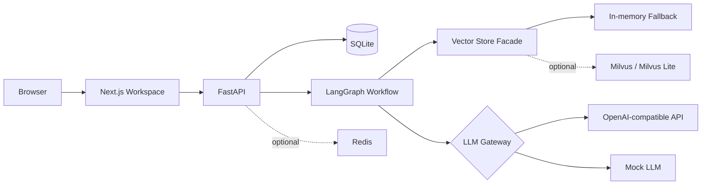
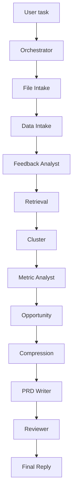

# FeedBackOS

面向产品经理的 Chat-first AI 需求发现工作台，用于用户反馈分析、机会点发现和 PRD 生成。

FeedBackOS 支持用户在一个聊天会话中上传客服工单、App 评论、用户访谈纪要、NPS 开放题、业务指标表、历史 PRD 或版本复盘文件，系统会先完成解析、清洗、结构化入库和向量化，再通过 LangGraph Agent workflow 进行反馈分析、痛点聚类、机会点评估、PRD 生成和 Reviewer 质量评审。


## 当前产品形态


## 核心能力

- 文件上传与数据接入：支持 CSV、Excel、TXT、Markdown、DOCX。
- Schema Detection：识别反馈字段、指标字段和文本类文件类型。
- 结构化入库：反馈、指标、文档 chunk、Agent trace、PRD、记忆和评估数据写入 SQLite。
- 轻量 RAG：反馈和文档 chunk 生成 embedding，写入向量检索层；Agent 运行时按当前会话检索相关证据。
- 多 Agent workflow：Orchestrator、File Intake、Data Intake、Feedback Analyst、Retrieval、Cluster、Metric Analyst、Opportunity、Compression、PRD Writer、Reviewer。
- 真实 LLM / Mock LLM 双模式：支持 OpenAI-compatible API；没有 Key 或调用失败时使用 mock 规则兜底。
- Reviewer 评审：检查 PRD 完整度、证据覆盖、幻觉风险、问题和建议。
- 历史 PRD：可以在同一会话中生成多个痛点对应的 PRD，例如“写一份针对支付体验痛点的 PRD”。
- Evaluation：从真实运行表计算 Agent、LLM、检索、质量和压缩指标。
- Fallback：Redis、Milvus 或真实 LLM 不可用时，系统仍可用 fallback/mock 跑完整流程。

## 技术栈

前端：

- Next.js
- TypeScript
- Tailwind CSS
- Recharts
- lucide-react

后端：

- FastAPI
- Python 3.11+
- LangGraph
- SQLAlchemy
- SQLite
- Pydantic
- Uvicorn
- python-docx

AI 与检索：

- OpenAI-compatible Chat Completions API
- OpenAI-compatible Embeddings API
- YAML Prompt 管理
- Mock LLM
- Mock embedding
- 内存 fallback vector store
- Redis 可选

## 架构



## Agent Workflow



当前 workflow 以固定顺序为主。Opportunity 节点会根据用户输入选择目标痛点。如果用户说“写一份针对支付体验痛点的 PRD”，系统会优先选择支付相关机会点，而不是始终选择最高优先级机会点。

## 数据处理流程

上传文件不会被直接整体发送给 LLM。

```text
上传文件
→ 文件解析
→ 字段识别或文本类型识别
→ 清洗和标准化
→ 写入 SQLite
→ 生成 embedding
→ 按 conversation_id 检索相关证据
→ 压缩上下文
→ 仅将相关压缩证据发送给 LLM
```

支持文件类型：

- CSV / Excel：反馈表或指标表。
- TXT / Markdown / DOCX：用户访谈、调研笔记、会议纪要、历史 PRD、版本复盘。

主要数据表：

- `conversations`, `conversation_messages`
- `uploaded_files`, `data_sources`
- `feedback_items`, `metric_snapshots`, `document_chunks`
- `insight_clusters`, `opportunities`, `prd_documents`
- `agent_runs`, `agent_steps`
- `llm_calls`, `retrieval_logs`, `compression_logs`
- `project_memory`, `decision_memory`, `user_preference_memory`

## Prompt 管理

Prompt 统一放在：

```text
backend/app/prompts/
```

运行时由下面的 loader 读取和缓存：

```text
backend/app/core/prompt_loader.py
```

当前接入的 prompt 文件：

- `feedback_analyst.yaml`
- `prd_writer.yaml`
- `reviewer.yaml`
- `compression.yaml`
- `default.yaml`

每个 prompt 文件包含元信息和 `system_prompt`：

```yaml
name: prd_writer
version: 1
owner: prd_writer_agent
response_format: json_object
system_prompt: |
  ...
```

`llm.py` 只负责模型选择、LLM 调用、Mock fallback 和调用日志记录。

## 本地运行

后端：

```bash
cd backend
python -m venv .venv
.venv\Scripts\activate
pip install -r requirements.txt
uvicorn app.main:app --reload
```

前端：

```bash
cd frontend
npm install
npm run dev
```

打开：

```text
http://localhost:3000
```

健康检查：

```text
http://localhost:8000/health
```

## 环境变量

复制 `.env.example` 为 `.env`，放在项目根目录。

```env
OPENAI_API_KEY=
OPENAI_BASE_URL=https://dashscope.aliyuncs.com/compatible-mode/v1
OPENAI_MODEL=qwen-plus
EMBEDDING_MODEL=text-embedding-v4
USE_MOCK_LLM=false

DATABASE_URL=sqlite:///./storage/feedbackos.db
REDIS_URL=redis://localhost:6379/0
MILVUS_LITE_PATH=./storage/milvus_lite.db
FRONTEND_ORIGIN=http://localhost:3000
```


如果没有真实 API Key：

```env
USE_MOCK_LLM=true
```

系统会使用 Mock LLM 和 mock embedding 跑完整流程。

## 如何测试系统效果

1. 端到端 Agent workflow 测试  
   在 Workspace 上传自己的反馈文件，等待解析、入库和向量化完成后，输入“分析当前反馈并生成 Top 机会点和 PRD”。检查右侧 PRD、Reviewer、Evaluation 是否更新。

2. 指定痛点 PRD 测试  
   输入“写一份针对支付体验痛点的 PRD”或“写一份针对 AI 回复体验痛点的 PRD”。检查 PRD 历史列表是否生成不同主题的 PRD。

3. 分类准确率测试  
   准备带人工标签的反馈文件，对比 `feedback_items` 中的情绪、模块、严重度和问题类型。

4. 检索 Top-K 可用率测试  
   输入专题问题，查看 `retrieval_logs` 和右侧结果是否与问题相关。

5. PRD 完整度测试  
   检查生成 PRD 是否包含九个固定章节，并确认没有“证据引用”章节。

6. Reviewer 拦截测试  
   生成 PRD 后查看 Reviewer 面板，确认 problems、suggestions、quality_score 和 evidence_coverage_score 是否合理。

7. 上下文压缩率测试  
   多次运行 Agent 后，在 Evaluation 面板查看平均压缩率，并可在 `compression_logs` 中查看原始 token、压缩后 token 和 compression rate。

## 部署建议

本地演示可以使用 SQLite。正式部署建议：

- 数据库从 SQLite 迁移到 PostgreSQL。
- 上传文件使用持久化 volume、S3、OSS 或 MinIO。
- 后端使用 Gunicorn + Uvicorn worker 或 Docker。
- 前端使用 `npm run build && npm run start`，或部署到支持 Next.js 的平台。
- 使用 Nginx/Caddy 做 HTTPS 和反向代理。
- Redis 和 Milvus 作为可选增强服务部署。
- 增加用户登录后，需要给 `projects`、`conversations`、`uploaded_files`、`feedback_items`、`prd_documents`、`agent_runs` 等表加用户归属或严格的 project ownership 校验。
